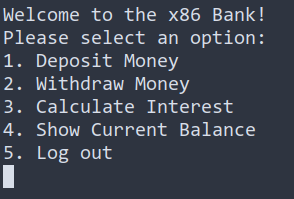

# x86-Bank

The x86 Bank is a console based banking application that
allows the user to deposit, withdraw, calculate interest,
 show their current balance. This program utilizes a database
in the form of a text file in order to store user credentials.
User's credentials are verified and updated when the user signs
in and when the user performs a withdraw/deposit.



## Contributors

- Sebastian Ala Torre
- Conan Nguyen
- Samuel Segovia
- Austen Bernal
- Bernardo Flores

## Building

### Windows

```shell
.\build.ps1
.\bin\x86Bank
```

### Linux

Dependencies:

- [wine](https://www.winehq.org/)

```shell
./build.sh
wine bin/x86Bank.exe
```
